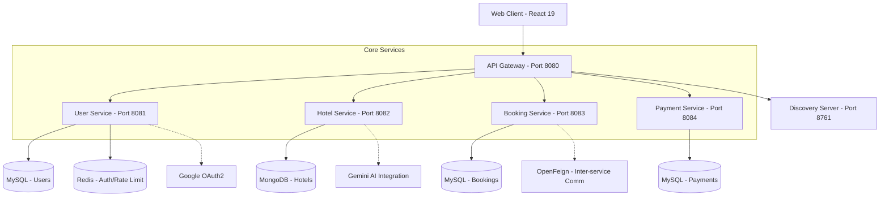

# 🏨 MicroStay — Hotel Booking Microservices Platform

MicroStay is a scalable, modern hotel booking platform built using a **Microservices Architecture**. It enables users to search hotels, book rooms, and make secure payments with high performance and fault isolation.

---

## 🚀 Overview

The platform provides a seamless experience for both travelers and hotel managers. It leverages cloud-native technologies to ensure scalability, security, and a fluid user interface.

## ✨ Features
- 🔐 **Two-Factor Authentication (2FA)**: Enhanced security via Redis-backed OTP verification sent to user email.
- 🏨 **Hotel Search & Booking**: Integrated system for discovering, filtering, and reserving stays.
- 🗺️ **Interactive Maps**: Real-time hotel discovery and location visualization using [Leaflet](https://leafletjs.com/).
- 🤖 **AI-Powered Experiences**: Google Gemini AI integration for smart reviews and an interactive chatbot.
- 💳 **Secure Payments**: Dedicated transaction service with status tracking (Initiated, Confirmed, Failed).
- 🔑 **Social Login**: Seamless authentication via **Google OAuth2** integration.
- 👤 **Role-Based Access Control (RBAC)**: Fine-grained permissions for **Admin**, **Manager**, and **User** roles.
- 📡 **Service Discovery**: Automatic microservice registration and discovery with **Netflix Eureka**.
- 🚪 **API Gateway**: Centralized entry point with distributed **Rate Limiting** (Redis) and CORS management.
- 📊 **Real-time Analytics**: Dynamic dashboards for revenue, bookings, and user statistics using **Chart.js**.
- 🧩 **Independent Scalability**: Modern architecture allowing each service to scale and deploy independently.


---

## 🏗️ Architecture

MicroStay follows a distributed system pattern:



---

## 🛠️ Tech Stack

### Backend
- **Core**: Java 17, Spring Boot 3.2.3
- **Microservices**: Spring Cloud (Eureka, Gateway, OpenFeign)
- **Databases**: MySQL (Relational), MongoDB (Documents), Redis (Cache/Rate Limit)
- **Security**: Spring Security, JWT, OAuth2

### Frontend
- **Core**: React 19, Vite
- **Styling**: Tailwind CSS 4, Framer Motion
- **Icons & Maps**: Lucide-React, Leaflet

---

## 📂 Project Structure

```text
microstay/
├── backend/
│   ├── apiGateway/       # Centralized entry point
│   ├── discoveryServer/  # Service Registry (Eureka)
│   ├── userService/      # User management & Auth
│   ├── hotelService/     # Hotel & Room management
│   ├── bookingService/   # Reservation processing
│   └── paymentService/   # Transaction handling
└── microStay_frontend/   # React 19 application
```

---

## ⚙️ Setup & Installation

### 1️⃣ Clone Repository
```bash
git clone https://github.com/bansalsangani09/MicroStay-Microservices-Based-Hotel-Booking-Platform-.git
cd 202526_SDP3_MicroStay
```

### 2️⃣ Start Services (Order)
1. **Service Registry**: Start `discoveryServer` first.
2. **Databases**: Ensure MySQL, MongoDB, and Redis are up.
3. **Core Services**: Start `userService`, `hotelService`, `bookingService`, `paymentService`.
4. **API Gateway**: Start `apiGateway` to route traffic.
5. **Frontend**: Run `npm install && npm run dev` in `microStay_frontend`.

---

## 🔐 Key Features
- **Real-time Map Search:** Interactive hotel discovery using Leaflet.
- **AI-Powered Filtering:** Advanced search patterns supported by Gemini AI.
- **Rate Limiting:** Distributed rate limiting using Redis and API Gateway.
- **Analytics Dashboard:** Visual insights for managers using Chart.js.
- **Secure Payments:** Integrated payment flow with dedicated service.

---

## 👨‍💻 Authors

- **Bansal Sangani**: [GitHub](https://github.com/bansalsangani09)
- **Kishan Kantariya**: [GitHub](https://github.com/Kantariya)

---

## 📜 License
This project is licensed under the **MIT License**.
